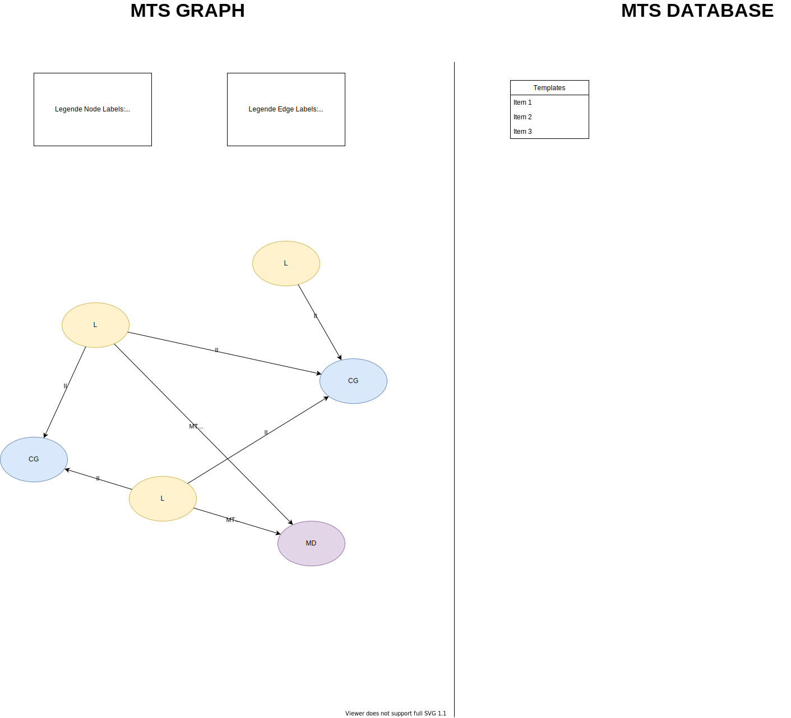

# MTS (Mode Template System)

Each mode has a template file.
These template files are designed to get used as:

1. Validation for incoming mode objects
2. Generation of Input UI elements in the frontend

To use a template for frontend UI Generation, the inputType from the inputs fields need to be staticly defined in the UI library. For example a Input could be of type "RANGE_2_DOUBLE" and the frontend uses a range slider for that. Defined once it is instantiated as often as needed. 

## MTS components

MTS templates consists of ***Mode***´s that define ***Input***´s. In addition ***MTSLight***´s are used to represent the actual devices and there states. ***MTSValue***´s is used to store current data in the UI. ***MTSControlGroup***´s can be defined to control multiple LEDs at once. In addition ***MTSMood***´s can be defined to build presets (MTSManipulator) for multiple devices. ***MTSManipulators*** define a state for a specific light with mode and on/off.

### Modes

A mode is a set of Inputs that are defined to abstract the store, UI generation and messaging between LED lights.

A mode consists of the following:

1. ***modeId*** a unique mode id
1. ***changeDate*** long, date when it was changed last
1. ***inputs*** a list of all inputs that are used and serialized by this mode


### Inputs

Inputs are representing one field in the messaging json and consist of the following definitions:
1. ***inputType*** the type of input, it is used to determine the type of value as well (single or array/list)
2. ***jsonkey*** in the resulting messaging json this is used to serialize it to ***"\<jsonkey\>" : "\<value\>"***
3. ***uiLabel*** this is the name of the input for the UI to show for example: above a slider


#### Input types

Available inputTypes are:

1. ***HSV*** - Hue, Value, Saturation
    - valueType = "ARRAY_DOUBLE"
    - length=3
1. ***HSVB*** - Hue, Saturation, Value, Brightness
    - valueType = "ARRAY_DOUBLE"
    - length=4
1. ***SINGLE_DOUBLE*** - single value (double)
    - valueType = "SINGLE_DOUBLE"
    - length = 1
1. ***RANGE_2_DOUBLE*** - range between two values
    - valueType = "ARRAY_DOUBLE"
    - length = 2

#### Value types

Available valueTypes:

1. ***SINGLE_DOUBLE***
2. ***ARRAY_DOUBLE***


## MTSValue

The MTSValue is a representation for the current value in for example: a UI element.

In a implementation you normally use a list as value and then parse the first x values into a json.

A MTSValue consist of:

1. ***valueType*** - derived from the template file
1. ***value*** - actual in the UI inserted value
1. ***jsonkey*** - derived from the template file for serialization

## MTSLight

Represents an actual device. Lights "connected" via MQTT and are listening to the topic "to/device/<***mac***>" and writing to "from/device/<***mac***>

A light needs to define:

1. ***name*** - name of the device
1. ***location*** - where the device is located
1. ***mac*** - unique UUID per device, not changable
1. ***curMode*** current set MTSMode
1. ***isOn*** true/false if light is on or not 

## MTSMood

A mood is a predefined set of manipulators that set a specific mode to the specified lamps.
1. ***manipulators*** - list of all manipulators

## MTSControlGroup

A ControlGroup simply gives the user the ability to set the same mode to multiple devices.

1. ***groupId*** - unique uuid
1. ***name*** - name for the control group
1. ***lampMacs*** - assosiated lampMacs

## MTSManipulator

Manipulators define the mode a specific lamp should be set to. This is mostly used as a list of manipulators for a MTSMood.

1. ***lightMac*** - mac of light that is set
1. ***mode*** MTSMode defined for that light

## Template files

Mode Template validation file<br/>
This files is used to validate if a given template-json is valid, only if the modeId field is unique cannot be tested

```jsonc
{
  "$schema": "http://json-schema.org/draft-04/schema#",
  "type": "object",
  "properties": {
    "modeId": {
      "type": "integer"
    },
    "inputs": {
      "type": "array",
      "items": [
        {
          "type": "object",
          "properties": {
            "inputType": {
              "type": "string"
            },
            "jsonKey": {
              "type": "string"
            },
            "uiLabel": {
              "type": "string"
            }
          },
          "required": [
            "inputType",
            "jsonKey",
            "uiLabel"
          ]
        }
      ]
    }
  },
  "required": [
    "modeId",
    "inputs"
  ]
}
```

# Implementation ideas

1. Graph based, learning and easier updatability after changes
1. use Label for node to find types easier (MOOD, CONTROL_GROUP, LIGHT etc.)
1. Serialize set modes to string and store in node


